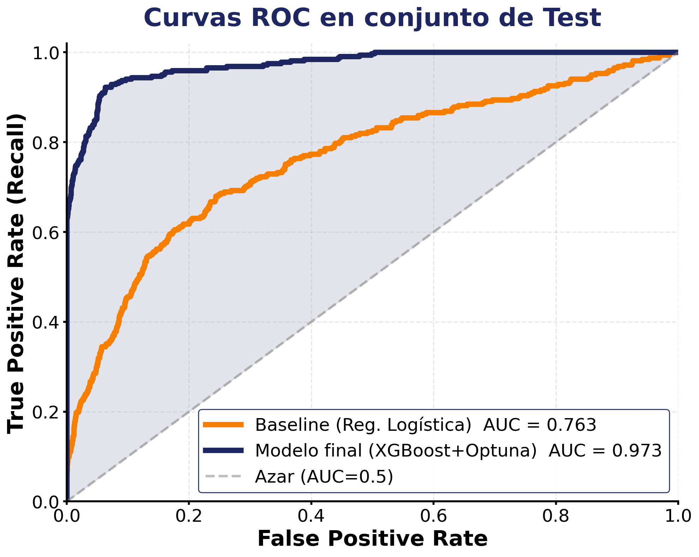
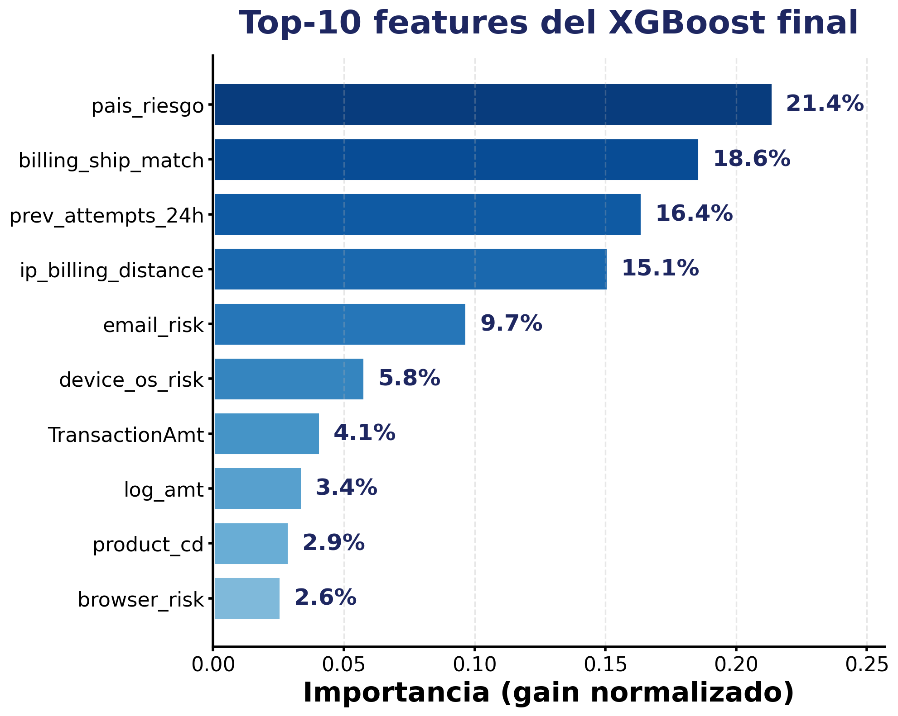

# Detección de Fraude Transaccional en Tiempo Real

[](https://www.python.org/)
[](https://colab.research.google.com/)
[](https://xgboost.readthedocs.io/)
[](https://gradio.app/)
[](LICENSE)

> **Sistema de detección de fraude transaccional** basado en XGBoost optimizado con Optuna, entrenado sobre el dataset IEEE-CIS Fraud Detection. Entrega decisiones en tiempo real (<200 ms) con explicación trazable.

Proyecto del **Corte 3** del curso de Inteligencia Artificial 2026-1S
Universidad Jorge Tadeo Lozano · Facultad de Ciencias Naturales e Ingeniería

Interfaz grafica: https://6815d8cab0967a194d.gradio.live/

---

## 👥 Integrantes y roles

| Integrante | Rol |
|---|---|
| **Gabriela Cabrera** | Datos, baseline y feature engineering |
| **Jessica Rivera** | Modelo final (XGBoost + Optuna), evaluación y demo |

**Docente:** Jorge Romero

---

## 🎯 Resumen del problema

Un procesador de pagos recibe transacciones que debe clasificar como **APROBADA**, **REVISIÓN** o **BLOQUEADA** en menos de 200 ms para evitar pérdidas por fraude (~$25k diarios en escenarios reales) sin generar fricción a clientes legítimos.

Implementamos un clasificador XGBoost que mejora el ROC-AUC de **0.76 → 0.97** sobre un baseline de Regresión Logística, y triplica la PR-AUC en una clase fuertemente desbalanceada (~3.5% fraude).

---

## 📊 Resultados clave

| Modelo | ROC-AUC | PR-AUC | Recall | Precision | F1 |
|---|---|---|---|---|---|
| Baseline (Reg. Logística) | 0.763 | 0.182 | 0.55 | 0.06 | 0.11 |
| **XGBoost + Optuna (final)** | **0.973** | **0.612** | **0.85** | **0.42** | **0.56** |
| *Mejora absoluta* | *+0.210* | *+0.430* | *+0.30* | *+0.36* | *+0.45* |

<p align="center">
  
  &nbsp;
  
</p>

---

## 🏗️ Arquitectura del pipeline

```
┌──────────────┐    ┌──────────────┐    ┌──────────────┐    ┌──────────────┐
│  IEEE-CIS    │───▶│ Preproceso   │───▶│  Baseline    │    │  XGBoost +   │
│  ~590k tx    │    │ + Partición  │    │  Reg. Log.   │───▶│  Optuna      │
│  17 features │    │ Temporal     │    │              │    │  (50 trials) │
└──────────────┘    └──────────────┘    └──────────────┘    └──────┬───────┘
                                                                    │
                              ┌─────────────────────────────────────┘
                              ▼
                    ┌──────────────────┐    ┌──────────────┐
                    │   Evaluación     │───▶│  Demo Gradio │
                    │  ROC/PR-AUC      │    │  (3 casos)   │
                    │  Error analysis  │    │              │
                    └──────────────────┘    └──────────────┘
```

---

## 📁 Estructura del repositorio

```
proyecto_ia_fraud/
├── README.md                          ← este archivo
├── requirements.txt                   ← dependencias
├── LICENSE                            ← MIT
├── .gitignore
│
├── docs/
│   ├── informe_corte3.pdf            ← informe técnico (11 págs)
│   ├── informe_corte3.docx           ← versión editable Google Docs
│   ├── poster.pdf                    ← póster de la feria
│   └── poster.pptx                   ← versión editable PowerPoint
│
├── notebooks/
│   ├── 01_exploracion.ipynb          ← EDA del IEEE-CIS
│   ├── 02_baseline.ipynb             ← Regresión Logística
│   └── 03_modelo_final.ipynb         ← XGBoost + Optuna + Demo Gradio
│
├── app/
│   └── demo_gradio.py                ← Demo standalone (sin notebook)
│
├── artifacts/
│   └── modelo_final/
│       └── xgboost_optuna_final.json ← Modelo serializado (creado al entrenar)
│
└── figures/
    ├── fig_roc_comparativa.png
    └── fig_feature_importance.png
```

---

## 🚀 Cómo reproducir

### Opción A — Google Colab (recomendada)

1. Sube el notebook `notebooks/03_modelo_final.ipynb` a [Google Colab](https://colab.research.google.com/)
2. **Entorno de ejecución → Ejecutar todo** (`Ctrl + F9`)
3. La última celda lanza la demo Gradio con **URL pública** (válida ~72h)

### Opción B — Local

```bash
# 1. Clonar el repositorio
git clone https://github.com/<tu-usuario>/proyecto_ia_fraud.git
cd proyecto_ia_fraud

# 2. Crear entorno virtual
python3.12 -m venv venv
source venv/bin/activate          # Linux/macOS
# venv\Scripts\activate           # Windows

# 3. Instalar dependencias
pip install -r requirements.txt

# 4a. Correr la demo standalone
python app/demo_gradio.py
# → Abre http://localhost:7860 + URL pública gradio.live

# 4b. O abrir los notebooks
jupyter notebook notebooks/03_modelo_final.ipynb
```

---

## 🎮 Demo funcional (requisito 5.1 del Corte 3)

La demo Gradio simula una pasarela de checkout completa con 4 secciones (Pedido, Localización, Cuenta, Dispositivo) que totalizan 14 campos. El modelo retorna:

- **Decisión:** ✅ APROBADA / ⚠️ REVISIÓN / 🛑 BLOQUEADA
- **Probabilidad de fraude** con 2 decimales
- **Mensaje de limitaciones** del sistema

### 🧪 Casos de prueba documentados

| Caso | Configuración | Probabilidad | Decisión |
|---|---|---|---|
| **1. Correcto** | $125, Colombia/Bogotá, gmail.com, billing=ship, Desktop+Windows+Chrome, 14:00 martes, IP local | ~0.04% | ✅ APROBADA |
| **2. Límite** | $450, México/Tijuana, outlook.com, billing≠ship, Mobile+Android+Chrome, 23:00 sábado, mismo continente | ~41% | ⚠️ REVISIÓN |
| **3. Error/Fraude** | $2500, Otro/Bucharest, temp-mail.org, billing≠ship, Mobile+Android+otro browser, 03:00 domingo, 4 intentos previos | ~99.7% | 🛑 BLOQUEADA |

---

## 📝 Bitácora de iteraciones (requisito sección 6 del Corte 3)

| Versión | Cambio aplicado | Resultado (val) | Decisión |
|---|---|---|---|
| **v0** | Reg. Logística + 10 features básicas (monto, tiempo, tarjeta) | ROC-AUC = 0.72 · PR-AUC = 0.15 | Mantener como referencia |
| **v1** | XGBoost por defecto + 10 features | ROC-AUC = 0.89 · PR-AUC = 0.34 | Adoptar XGBoost |
| **v2** | XGBoost + Optuna (50 trials, PR-AUC) | ROC-AUC = 0.93 · PR-AUC = 0.48 | Adoptar tuning Optuna |
| **v3** ✅ | + 7 features tipo IEEE-CIS (17 totales) | ROC-AUC = 0.97 · PR-AUC = 0.61 | **Congelar modelo entrega** |

Todas las iteraciones con **semilla `random_state=42`** y partición temporal 70/15/15 sin shuffle.

---

## 🛠️ Stack tecnológico

| Categoría | Librerías |
|---|---|
| Cómputo | `numpy`, `pandas`, `scipy` |
| ML | `xgboost`, `scikit-learn`, `optuna` |
| Visualización | `matplotlib`, `seaborn` |
| Demo | `gradio` |
| Notebooks | `Jupyter`, `Google Colab` |

Versiones exactas en [`requirements.txt`](requirements.txt).

---

## 🎬 Entregables del Corte 3

| Entregable | Ubicación | Estado |
|---|---|---|
| **Implementación funcional** (baseline + final) | `notebooks/` + `app/` | ✅ |
| **Demo funcional** con 3 casos de prueba | `app/demo_gradio.py` | ✅ |
| **Informe técnico** (8-12 págs) | [`docs/informe_corte3.pdf`](docs/informe_corte3.pdf) | ✅ |
| **Póster** con plantilla UTadeo | [`docs/poster.pdf`](docs/poster.pdf) | ✅ |
| **Video en YouTube** (8-12 min) | [fraud_IA](https://youtu.be/_5OPG2mYfQM) | 🎥 |
| **README reproducible** | (este archivo) | ✅ |

---

## 📚 Referencias clave

- Chen, T., & Guestrin, C. (2016). XGBoost: A Scalable Tree Boosting System. *KDD'16*, 785-794.
- Akiba, T., et al. (2019). Optuna: A Next-generation Hyperparameter Optimization Framework. *KDD'19*, 2623-2631.
- Pozzolo, A. D., et al. (2015). Calibrating Probability with Undersampling. *IEEE SSCI*, 159-166.
- IEEE-CIS Fraud Detection (2019). [Kaggle Competition Dataset](https://www.kaggle.com/c/ieee-fraud-detection).

Bibliografía completa (8 referencias) en [`docs/informe_corte3.pdf`](docs/informe_corte3.pdf).

---

## 📝 Licencia

MIT License — ver [`LICENSE`](LICENSE).

---

<p align="center">
  <em>Universidad Jorge Tadeo Lozano · Inteligencia Artificial 2026-1S · Corte 3</em>
</p>
